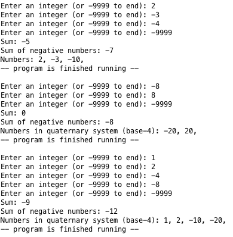
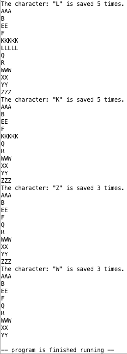

# MIPS Assembly Language Programs Collection 💾

👨‍💻 This repository contains a collection of MIPS assembly language programs I developed during my studies in the *Computer Organization course (20471)* at the **Open University of Israel** in 2022a. These programs are crafted to demonstrate the versatility and practical applications of assembly programming in various domains.

🚀 Each program in this collection showcases unique functionalities, ranging from number systems and string manipulation to linked list operations in assembly language. Notably, the programs [`q2`](q2.asm) and [`q3`](q3.asm) were part of my course assignments and earned a perfect score of `100`. The program [`SumAndConvertInput`](SumAndConvertInput.asm) was developed later as a personal project, improving `q2` to handle user input, while exploring the intricacies of assembly programming.

📚🖥️ These projects serve as an excellent resource for educational purposes, offering insights into the intricacies of assembly language. Whether you're a student, a hobbyist, or someone curious about low-level programming, these programs provide a hands-on experience to deepen your understanding of assembly language.

*Enjoy exploring the features and functionalities of these assembly language programs! Dive into the world of programming and discover the power of MIPS assembly language.*

- [SumAndConvertInput 🧮](#sumandconvertinput-)
  - [Overview 📌](#overview-)
  - [Features 🌟](#features-)
  - [How to Use 💡](#how-to-use-)
  - [Example 📝](#example-)
- [q3: Most Common Letter Finder and String Modifier 📝](#q3-most-common-letter-finder-and-string-modifier-)
  - [Overview 🌐](#overview--1)
  - [Features 🌟](#features--1)
  - [How to Use 💡](#how-to-use--1)
  - [Example 📝](#example--1)
- [q2: Linked-List Integer Sum and Quaternary Conversion 🧬](#q2-linked-list-integer-sum-and-quaternary-conversion-)
  - [Overview 🌐](#overview--2)
  - [Features 🌟](#features--2)
  - [How to Use 💡](#how-to-use--2)
- [System Requirements 🖥️](#system-requirements-️)
- [Contributions and Feedback 🤝](#contributions-and-feedback-)
- [License 📜](#license-)

---

## SumAndConvertInput 🧮

### Overview 📌

`SumAndConvertInput` is a versatile assembly program designed to process a list of user-input integers. This program offers functionalities including summing all entered numbers, calculating the sum of negative numbers, and converting each number in the list to its quaternary (base-4) representation. It's an excellent tool for educational purposes and for those interested in number systems and their conversions.

### Features 🌟

- **Sum Calculation**: Compute the sum of all entered integers.
- **Negative Sum**: Calculate the sum of only the negative numbers in the list.
- **Quaternary Conversion**: Convert each number in the list to its equivalent in the quaternary numeral system.

### How to Use 💡

- Compile the program using a MIPS assembler.
- Run the compiled program.
- Input numbers as prompted (end input with `-9999`).
- View results for sum, negative sum, and quaternary conversion.

### Example 📝

---

## q3: Most Common Letter Finder and String Modifier 📝

### Overview 🌐

`q3` identifies the most common letter in a static string, deletes its occurrences, and allows for iterative processing on the modified string.

### Features 🌟

- **Finding the Most Common Letter**: Identify the most frequently occurring letter in a predefined string.
- **Lexicographic Ordering**: Display string characters in lexicographic order based on their occurrence count.
- **Interactive Deletion**: Restart the program with the modified string for continuous processing.

### How to Use 💡

- Compile the program with a MIPS assembler.
- Run the compiled code in a MIPS-compatible simulator or environment.
- Observe outputs for the most common letter, lexicographically ordered string, and deletion functionality.

### Example 📝

The following example demonstrates the program's functionality for the string `"AEZKLBXWZXYALKFKWZRYLAKWLQLEK"`, which has the most common letter `"L"`. Notice that the program restarts with the modified string after each deletion.

---

## q2: Linked-List Integer Sum and Quaternary Conversion 🧬

### Overview 🌐

`q2` operates on a predefined linked list of integers, computing their sum and converting them to quaternary numeral system representation.

### Features 🌟

- **Summing Numbers**: Calculate the sum of all integers in the linked list.
- **Summing Positive Numbers Divisible by 4**: Sum positive numbers in the list divisible by 4.
- **Quaternary System Representation**: Convert and display each number in the list to its quaternary equivalent.

### How to Use 💡

- Compile the program using a MIPS assembler.
- Run the compiled code in a MIPS-compatible environment or simulator.
- Observe the outputs for total sum, sum of positives divisible by 4, and quaternary representation.

---

## System Requirements 🖥️

- MIPS architecture (or an emulator like MARS MIPS simulator).
- Basic understanding of assembly language.

## Contributions and Feedback 🤝

Contributions, suggestions, and feedback are welcome! Feel free to open an issue or submit a pull request.

## License 📜

These projects are open source and available under the [MIT License](LICENSE).
